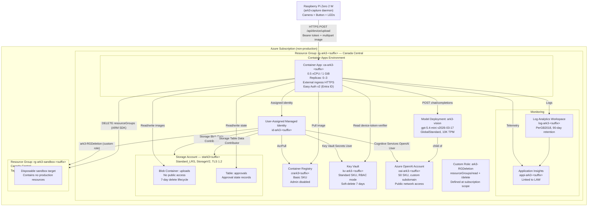

# Architecture

> ⚠️ **SANDBOX / NON-PRODUCTION ONLY.** No Azure deployment has been performed. All diagrams represent the **planned** architecture as designed and implemented in this repository. They have not been verified against a live Azure resource group.

---

## System narrative

ark-3 is a portable proof-of-concept system that lets an operator delete a disposable Azure resource group by photographing a printed label. The primary motivation is to constrain irreversible Azure operations to an explicitly human-supervised, physically present, multi-gate workflow — suitable only for non-production, pre-approved, disposable target resource groups.

### Physical layer

A **Raspberry Pi Zero 2 W** runs a Python daemon (`ark3-capture`). A momentary button triggers an image capture via the **Camera Module 3** (using `libcamera` / `picamera2`). Two LEDs (green and red) give the operator immediate visual feedback: ready, capturing, uploading, queued, or error. Captures are queued to local SQLite storage and uploaded to the backend via HTTPS with a per-device bearer token. The daemon runs as a least-privilege system service (`ark3` user) with no ability to access Azure directly.

### Cloud layer

The **backend** is a **Node.js / Fastify** application deployed as an **Azure Container App** in Canada Central. It receives the image upload and immediately:

1. Validates the bearer token against a hex-encoded SHA-256 hash stored in **Azure Key Vault** (read via managed identity, constant-time comparison).
2. Stores the image in **Azure Blob Storage** (`uploads` container, 7-day lifecycle).
3. Records an approval state entry in **Azure Table Storage** (`approvals` table).
4. Dispatches an asynchronous OCR pipeline (fire-and-forget; the device receives HTTP 202 immediately).

The OCR pipeline:
1. Downloads the image from Blob Storage.
2. Sends it to **Azure OpenAI** (`gpt-5.4-mini`, `GlobalStandard`, Canada Central) via the managed identity (`Cognitive Services OpenAI User` role).
3. The model returns `{ resourceGroupName, rawText, uncertainty }`.
4. The backend validates the proposed name against Azure RG naming grammar (regex).
5. Performs an exact, case-insensitive lookup in the configured subscription via **Azure Resource Manager SDK**.
6. Checks the name against the operator-configured **allowlist** (`ARK3_RG_ALLOWLIST`).
7. Checks that the matched RG has the tag `ark3-disposable=true`.
8. Derives the canonical ARM ID: `/subscriptions/{id}/resourceGroups/{name}`.
9. Issues a one-time **nonce** (10-minute expiry) and updates the approval record to `awaiting_approval`.

### Approval layer

The **web frontend** (React SPA, served by the backend) is protected by **Easy Auth v2** (Microsoft Entra ID) on all paths except `/api/device/upload` and `/api/health`. The SPA reads pending approvals via `GET /api/pending`, displays the source image (served through the authenticated `GET /api/images/:id` endpoint), the proposed RG name, the canonical ARM ID, Azure tags, and the subscription display label.

State-mutating requests (`POST /api/approve/:id`, `POST /api/reject/:id`) require:
- A valid Easy Auth session (Entra ID)
- An `approver` role claim
- A matching **CSRF token** (double-submit cookie pattern, `SameSite=Strict`)
- A matching **nonce** and **version** (optimistic concurrency)

On approval, the backend immediately **re-validates all gates** against live ARM state (TOCTOU protection) before executing `ResourceManagementClient.resourceGroups.beginDeleteAndWait`. A daily cap (`ARK3_DAILY_DELETION_CAP`, default 10) limits blast radius.

### Identity and access

A single **User-Assigned Managed Identity** (UAMI) carries all backend-to-Azure access. No API keys or connection strings are used in the data path. Role assignments are resource-scoped:

| Role | Resource |
|---|---|
| AcrPull | Container Registry |
| Storage Blob Data Contributor | Storage Account |
| Storage Table Data Contributor | Storage Account |
| Key Vault Secrets User | Key Vault |
| Cognitive Services OpenAI User | Azure OpenAI account |
| Custom `ark3-RGDeletion` | Sandbox target RG only |

The custom role grants only `Microsoft.Resources/subscriptions/resourceGroups/read` and `Microsoft.Resources/subscriptions/resourceGroups/delete`, scoped to the sandbox RG. It does not grant subscription-wide Contributor or any write access to resources within the sandbox RG.

### Monitoring

**Log Analytics Workspace** and **Application Insights** receive structured audit events for every state transition: `upload_received`, `ocr_dispatched`, `ocr_succeeded`, `ocr_failed`, `validation_passed`, `validation_failed`, `deletion_started`, `revalidation_failed`, `deletion_failed`, `deletion_succeeded`, `approval_granted`, `approval_rejected`.

---

## Process flow diagram

The diagram below is mirrored in [diagrams/process-flow.mmd](../diagrams/process-flow.mmd).

```mermaid
sequenceDiagram
    participant Pi as Pi Zero 2 W<br/>(ark3-capture daemon)
    participant API as Container App<br/>(Node.js / Fastify)
    participant KV as Key Vault
    participant Blob as Blob Storage<br/>(uploads container)
    participant Table as Table Storage<br/>(approvals table)
    participant Vision as Azure OpenAI<br/>(gpt-5.4-mini)
    participant ARM as Azure Resource Manager
    participant UI as Web UI<br/>(Easy Auth + React SPA)

    Note over Pi: Button pressed
    Pi->>Pi: Capture JPEG (libcamera)
    Pi->>Pi: Enqueue to local SQLite
    Pi->>API: POST /api/device/upload<br/>Bearer &lt;token&gt;<br/>X-Device-Name: &lt;name&gt;<br/>multipart/form-data image
    API->>API: Rate-limit check (sliding window, per device)
    API->>KV: Get secret device-token-verifier (UAMI)
    KV-->>API: Hex SHA-256 hash
    API->>API: Constant-time token verification
    API->>Blob: Upload JPEG (UAMI)
    API->>Table: Create record (status: ocr_pending)
    API-->>Pi: 202 Accepted { uploadId, status: ocr_pending }
    Note over API: OCR pipeline (async, fire-and-forget)
    API->>Blob: Download image (UAMI)
    API->>Vision: POST chat/completions (UAMI, image + prompt)
    Vision-->>API: { resourceGroupName, rawText, uncertainty }
    API->>API: Validate RG name grammar
    API->>ARM: List resource groups (exact lookup, one subscription)
    ARM-->>API: Matched RG metadata (name, tags, ID)
    API->>API: Allowlist check (ARK3_RG_ALLOWLIST)
    API->>API: Tag check (ark3-disposable=true)
    API->>API: Derive canonical ARM ID
    API->>API: Issue one-time nonce (10-min expiry)
    API->>Table: Update record (status: awaiting_approval, canonicalRgId, nonce)

    Note over UI: Operator opens dashboard
    UI->>API: GET /api/pending (Easy Auth session)
    API-->>UI: [{ id, imageRoute, proposedName, canonicalRgId, tags, version, nonce }]
    UI->>API: GET /api/images/:id (Easy Auth session)
    API->>Blob: Download image (UAMI)
    API-->>UI: JPEG image bytes
    Note over UI: Operator reviews image + canonical ID

    UI->>API: POST /api/approve/:id<br/>X-CSRF-Token: &lt;token&gt;<br/>{ nonce, version }
    API->>API: Verify Easy Auth session + approver role
    API->>API: Verify CSRF double-submit
    API->>API: Check daily deletion cap
    API->>Table: Transition to deleting, consume nonce (optimistic concurrency)
    Note over API: TOCTOU re-validation
    API->>ARM: Exact RG lookup + allowlist + tag re-check
    ARM-->>API: Live RG metadata confirmed
    API->>ARM: DELETE resourceGroups/&lt;name&gt; (UAMI, custom role)
    ARM-->>API: 200/202 Accepted
    API->>Table: Update record (status: deleted)
    API-->>UI: { success: true, canonicalRgId, completedAt }
```

---

## Planned Azure infrastructure diagram

The diagram below is mirrored in [diagrams/infrastructure.mmd](../diagrams/infrastructure.mmd).



---

## Network and public endpoints rationale

All Azure resources use public network access. This is intentional for this proof-of-concept:
- The Pi Zero 2 W uploads over the public internet (no VPN/private endpoint practical on Pi Zero).
- Azure Container Apps on the Consumption plan does not support VNet injection without a premium SKU.
- VNet injection is a production hardening step outside the current sandbox scope.

The following compensating controls are applied instead:
- All traffic is TLS-only (minimum TLS 1.2 on Storage).
- Device authentication uses a bearer token verified against a Key Vault–stored hash, not an open endpoint.
- Blob storage has no public blob access (`allowBlobPublicAccess: false`); images are served only through the authenticated API.
- Key Vault uses RBAC mode; no access policies that could grant broader access.

---

## GitHub / CI build path

On every merge to `main`, CI (GitHub Actions) is expected to:
1. `az acr build --registry <acrName> --image ark3-api:latest apps/backend`
2. `az containerapp update --name <caName> -g <controlRg> --image <acrName>.azurecr.io/ark3-api:latest`

CI authenticate to ACR using `az acr build` (which uses the GitHub Action's Azure credentials) or via `az acr login --expose-token`. No CI workflow file is committed yet; this is a documented expectation for production operationalization.
